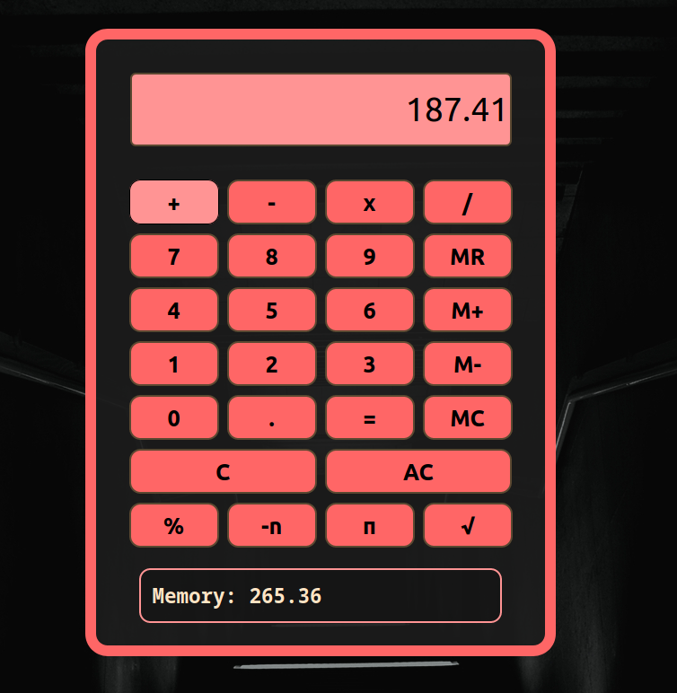

# Javascript Calculator

> Calculator app written in Javascript, HTML & CSS

  

Check out the calculator [here](https://bbastanza.github.io/Calculator/)

## Summary

I made this app continuing to further my knowledge of Javascript, HTML and CSS.

Building this app I had to figure out calculations using more challenging logic than I had used in previous applications. I had a lot of fun with this writing the applications functionallity and style.

While building this application I had to problem solve to make this calculator use continuous function, know when to edit which number and to use the memory buttons correctly.

#

## Author

### Brian Bastanza- Full Stack Web Developer

<a href="https://www.brianbastanza.me/" target="_blank" rel="noopener">Personal Website</a>

[LinkedIn](www.linkedin.com/in/brian-bastanza-9035397b)
